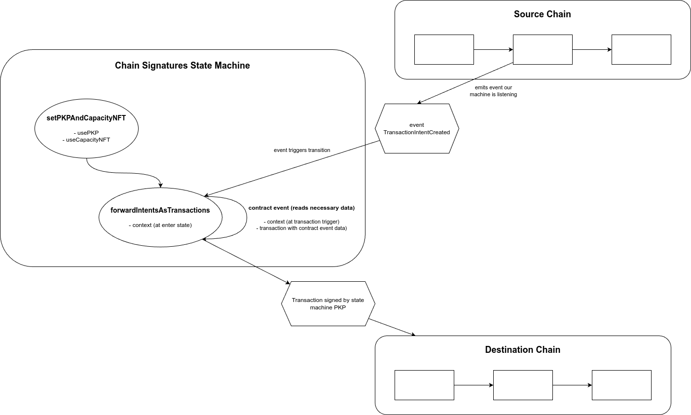

# Using Lit for Chain Signatures

The following is an example of how you can use the `@lit-protocol/event-listener` package from the [Lit SDK](https://github.com/LIT-Protocol/js-sdk) to create and automate cross-chain transactions. This package gives you the ability to listen to events from any source chain and use it to trigger a transaction on your desired destination chain

## Introduction

This example uses Lit to listen to custom 'transaction request' events on an origin chain and uses them to execute the specified transaction on your desired destination chain.

We use the TransactionEmitter contract, deployed on the Base Sepolia chain, to listen for transaction
requests.
We then use the Lit event listener package to forward the transaction request to the specified destination chain. In this example we are using Ethereum Sepolia.

The specific chains, contracts, and transaction events that you want to execute and listen for are fully customizable and dynamic and can be configured in the event listener script that you create. Just make sure that you load your PKPs with native tokens from the destination chain to handle gas.

## How it works



When a transaction request is received on the source chain, the TransactionEmitter contract emits a
TransactionIntentCreated event.

The TransactionIntentCreated event contains the following information:

- Chain ID: The ID of the chain where the transaction is being broadcast.
- To: The address of the target contract on the destination chain.
- Value: The amount of native currency to be transferred (in the destination chain's native currency).
- Data: The encoded transaction data.

That is, all the necessary information to construct a transaction on the destination chain is included in the
TransactionIntentCreated event.

Then a Lit Protocol event listener script subscribes for the TransactionIntentCreated event and decodes the transaction data,
constructs a transaction for the destination chain, and sends it to the target contract address.

## Project Structure

- evm: Contains the Solidity contracts used for the example.
    - StringStorage.sol: A simple contract that stores a string value.
    - TransactionEmitter.sol: A contract that emits TransactionIntentCreated events when a transaction is received.
- server: Contains the event listener script that subscribes for TransactionIntentCreated events and forwards them to the
  target contract on the destination chain.
- client: Contains the script that sends a transaction to the target contract on the destination chain using the source
  chain's TransactionEmitter contract and, transitively, the event listener script.

## Prerequisites

- Node.js and npm installed
- A Lit PKP funded with some Sepolia ETH, enough to pay for gas
- An Ethereum private key, as an authorized signer of the PKP
- If you are using a Lit Network that [requires payment](https://developer.litprotocol.com/paying-for-lit/overview) make sure that you have minted Capacity Credits and [delegated them](https://developer.litprotocol.com/paying-for-lit/delegating-credit) to your PKP to use

## Running

1. Install dependencies on `server`, `client` and `evm` folders

2. Copy each .env.example file to .env and fill in the required values:

- ETHEREUM_PRIVATE_KEY=<YOUR_PRIVATE_KEY>
- RPC_URL_SEPOLIA=https://ethereum-sepolia-rpc.publicnode.com # Or use your own RPC URL
- RPC_URL_BASE_SEPOLIA=https://sepolia.basescan.org # Or use your own RPC URL
- STRING_STORAGE_ADDRESS=0x2a8505Cf7e2d2b25Ca49988Ddc22BC315713401F # Ethereum Sepolia. Or use your own address
- TRANSACTION_EMITTER_ADDRESS=0x3966a9746A814Bf9E4F33AB6453077A7B12AD759 # Base Sepolia. Or use your own address

3. Fill the `pkp` and `capacityTokenId` if used, values at `server/forwardTxs.ts` file with the previously created Lit PKP and Capacity NFT.

4. On `client/sendCrossChainTx.ts` file, you can change `newString` value to modify the string that will be stored on the destination chain StringStorage contract.

5. Build the ABI files for client and server to consume
```bash
cd evm
forge build
```

6. Start the server and wait until seeing `enter forwardIntentsAsTransactions` in the console to ensure it is listening for events
```bash
cd server
npm run dev
```

7. Start the client and wait until the process completes
```bash
cd client
npm run dev
```

The client script will print the new string and who updated it, which should be the Lit event listener PKP address
```
...
StringUpdated event received:
New String: ChainSignatures are alive!!!
Updater: 0xYOUR_PKP_ADDRESS
...
```
